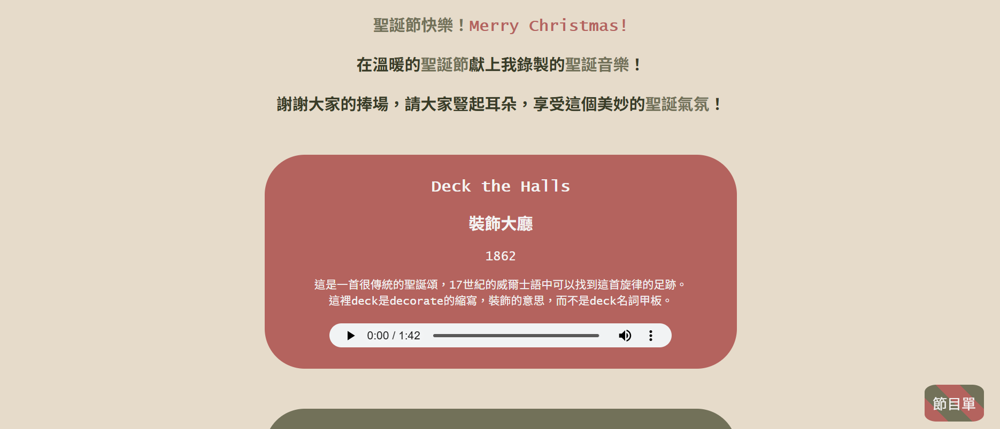
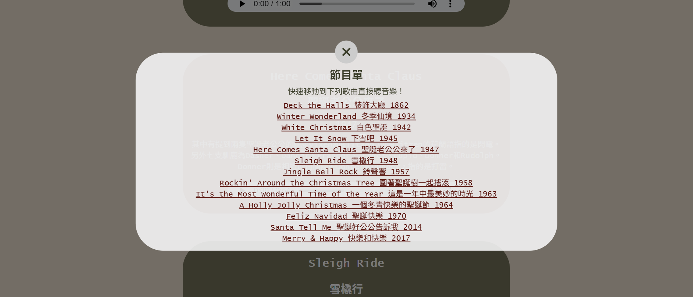

# Merry Christmas! 

Listen to Christmas music song covers that I recorded on Steinway to celebrate Christmas 2021 here, and learn some fun facts with these festive tunes! 

Thee are thirteen songs in total, and you can listen to them all for **20 minute and 21 seconds >v<**. 

### View the page and enjoy the music [here](https://graziosog.github.io/xmas21/xmas21.html).

## Color Palette Description

**#B4635E (Muted Terracotta/Faded Brick Red)**

This color is warm, slightly desaturated red with brown and orange undertones. It is a warm, earthy tone that is not overly bright, having a somewhat dusty or muted quality. This warm, earthy red provides a subtle nod to the traditional Christmas red without being overwhelming. 

**#727159 (Muted Olive Green/Moss)**

This is a neutral, desaturated green with strong yellow and gray undertones, evoking evergreen trees and foliage in a sophisticated, grounded manner. This hue brings feelings of stability, nature, and peace. It has an earthy, muted quality that suggests a sense of calm and balance. 

**#E6DBCA (Soft Beige/Pale Sand)**

This light neutral acts as a warm, neutral, inviting base color, softening the deeper tones and providing a sense of calm. It is often seen as a gentle, calming color associated with warmth, optimism, and creativity without being overwhelming. It has an ashy, dusty quality that gives it a soft, delicate feel.

## Special Features

- The color palette moves away from a highly saturated, traditional look toward a more organic and tranquil aesthetic. The carefully curated look honors the warmth and the spirit of the Christmas season in a rustic but contemporary way.

- Do you notice the candy wrapper look of the program pop-up toggle?
  
- The program is designed as a pop-up modal with links that bring you to the song selected. 

- All songs are recorded on Steinway, delivering a warm and festive feeling. 

- Check out the bonus songs are at the end of the page. 
